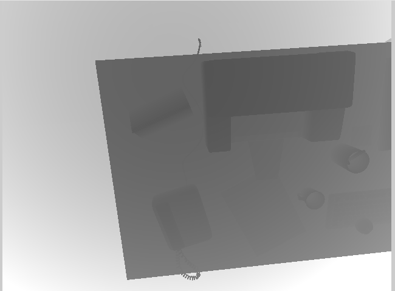

# Mono Depth Estimation using Moving Stereo Approach

## About the Repo
This is a depth fusion technique using Gaussian Distribution-based pixel depths and Kalman updates. By leveraging Pose-derived baselines, it establishes epipolar lines, employs NCC for block matching, calculates depth using baselines, and fuses the data via the Kalman Equation. 

This method offers a comprehensive approach to refining depth estimation from multi-angled scene images.

The Results that we obtain is as follows
## Output
<table>
  <tr>
      <td align = "center">  </td>
      <td align = "center">  </td>
  </tr>
  <tr>
      <td align = "center">Ground Truth</td>
      <td align = "center">Result</td>
  </tr>
</table>

## Note
The helper functions for reading/writing were written by Dr. Gao. I just rewrote the implementation for learning purposes :) 
